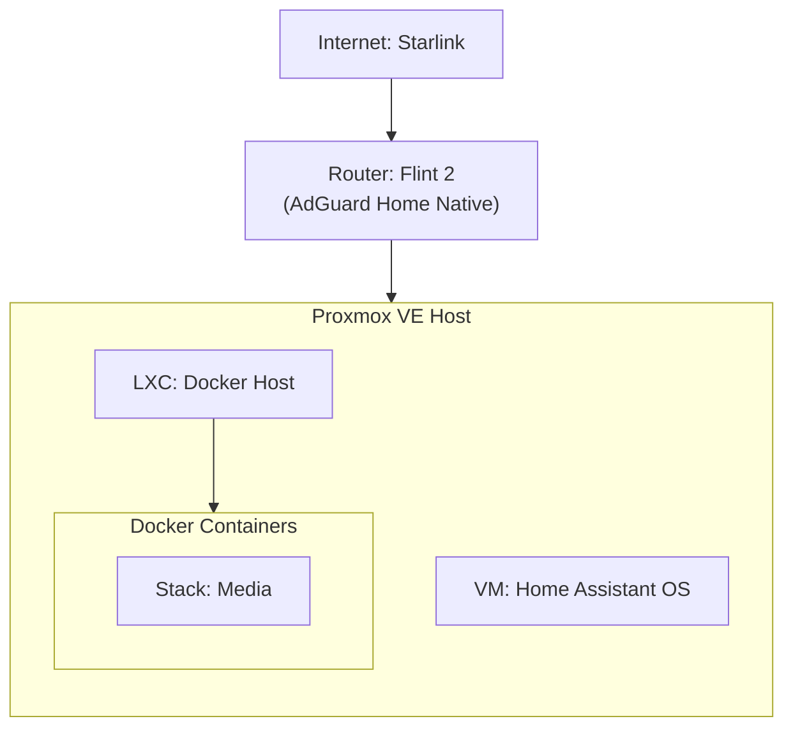

# 🏡 Dan-EL's Homelab

## 📋 Summary

Welcome to the documentation for my personal homelab. This repository serves as a configuration backup and an architectural reference.

The core infrastructure is built on **Proxmox VE**. To maintain a clean and reproducible setup, I utilize **LXC containers** for most services to keep overhead low.

**Core Architecture:**

1.  **Hypervisor:** Proxmox VE.
2.  **Provisioning:** LXCs are created using the [Proxmox VE Helper-Scripts](https://community-scripts.github.io/ProxmoxVE/).
3.  **Application Layer:** A specific "Docker Host" LXC runs Portainer/Docker, which manages various application stacks (Media, Smarthome, etc.).

---

## 🖥️ Hardware

| Device           | Model      | CPU                                    | RAM         | Storage                                                                                        | Kernel             |
| :--------------- | :--------- | :------------------------------------- | :---------- | :--------------------------------------------------------------------------------------------- | :----------------- |
| **Proxmox Host** | HP 290 SFF | Intel Core i3-8100 @ 3.60GHz (4 Cores) | 32GB (DDR4) | 94GB (Boot/Root) + 4TB Samsung 990 PRO SSD + 5TB Seagate One Touch HDD + 12TB Seagate Exos HDD | Linux 6.14.8-2-pve |

> **Note:** System currently running PVE Manager 9.0.3.

---

## 🌐 Networking

- **Router:** Starlink ISP + GL-iNET Flint 2 router
- **DNS:** handled by AdGuard Home on router
- **Reverse Proxy:** Nginx Proxy Manager (local access) / Clouflare Tunnel (remote access)
- **VPN:** Wireguard / Tailscale

### Topology Diagram

