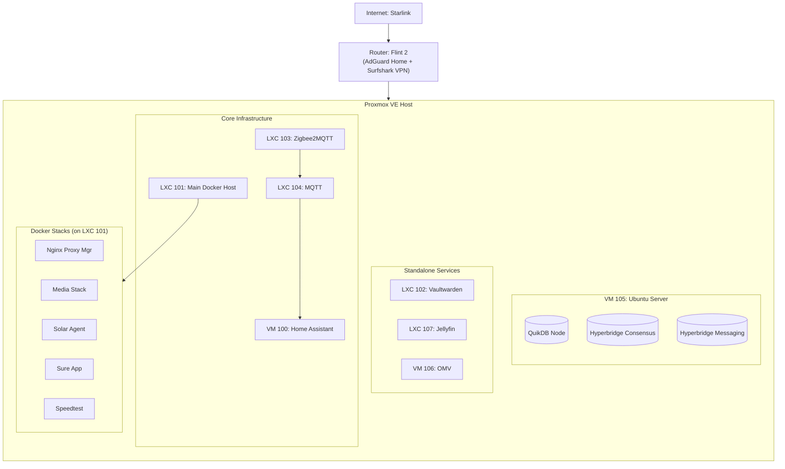

# 🏡 Dan-EL's Homelab


## 📋 Summary

Welcome to the documentation for my personal homelab. This repository serves as a configuration backup and an architectural reference.

The core infrastructure is built on [**Proxmox VE**](https://www.proxmox.com/en/products/proxmox-virtual-environment/overview). To maintain a clean and reproducible setup, I utilize **LXC containers** for most services to keep overhead low.

**Core Architecture:**

1.  **Hypervisor:** Proxmox VE.
2.  **Provisioning:** LXCs are created using the [Proxmox VE Helper-Scripts](https://community-scripts.github.io/ProxmoxVE/).
3.  **Application Layer:** A specific "Docker Host" LXC runs [Portainer](https://github.com/portainer/portainer), which manages various application stacks.

---

## 🖥️ Hardware

| Device           | Model                                                                         | CPU                                              | RAM         | Storage                                                                                        | Kernel / OS                 |
| :--------------- | :---------------------------------------------------------------------------- | :----------------------------------------------- | :---------- | :--------------------------------------------------------------------------------------------- | :-------------------------- |
| **Proxmox Host** | [HP 290 G1 SFF](https://support.hp.com/us-en/document/ish_4947891-4947986-16) | Intel Core i3-8100 @ 3.60GHz (4 Cores)           | 32GB (DDR4) | 94GB (Boot/Root) + 4TB Samsung 990 PRO SSD + 5TB Seagate One Touch HDD + 12TB Seagate Exos HDD | Linux 6.14.8-2-pve          |
| **Router**       | [GL.iNet Flint 2 (GL-MT6000)](https://www.gl-inet.com/products/gl-mt6000/)    | MediaTek MT7986 (Filogic 830) Quad-core @ 2.0GHz | 1GB DDR4    | 8GB eMMC                                                                                       | OpenWrt 23.05 (Kernel 5.15) |

> **Note:** System currently running PVE Manager 9.0.3.

---

## 🌐 Networking

- **Router:** Starlink ISP + GL-iNET Flint 2 router
- **DNS:** handled by AdGuard Home on router
- **Reverse Proxy:** Nginx Proxy Manager (local access) / Clouflare Tunnel (remote access)
- **VPN:** Surfshark / Tailscale (remote access too)

### Topology Diagram



## 🛠️ Services & Inventory

### 1. Proxmox LXC/VM Inventory

All LXCs below were provisioned using the [Proxmox VE Helper-Scripts](https://community-scripts.github.io/ProxmoxVE/).

| ID      | Name                                                                 | Type | Helper Script Used                                                                                               | Notes                                                                                                                                                             |
| :------ | :------------------------------------------------------------------- | :--- | :--------------------------------------------------------------------------------------------------------------- | :---------------------------------------------------------------------------------------------------------------------------------------------------------------- |
| **100** | [`homeassistant`](https://github.com/home-assistant)                 | VM   | [Home Assistant OS](https://raw.githubusercontent.com/community-scripts/ProxmoxVE/main/vm/haos-vm.sh)            | Open source home automation that puts local control and privacy first.                                                                                            |
| **101** | [`docker`](https://github.com/docker)                                | LXC  | [Docker](https://raw.githubusercontent.com/community-scripts/ProxmoxVE/main/vm/haos-vm.sh)                       | Docker is a containerization platform that provides easy way to containerize your applications.                                                                   |
| **102** | [`vaultwarden`](https://github.com/dani-garcia/vaultwarden)          | LXC  | [Vaultwarden](https://raw.githubusercontent.com/community-scripts/ProxmoxVE/main/install/vaultwarden-install.sh) | Vaultwarden is a powerful and flexible alternative password manager to Bitwarden that is particularly suitable for users who want to manage their data themselves |
| **103** | [`zigbee2mqtt`](https://github.com/Koenkk/zigbee2mqtt)               | LXC  | [Zigbee2MQTT](https://raw.githubusercontent.com/community-scripts/ProxmoxVE/main/install/zigbee2mqtt-install.sh) | Zigbee2MQTT bridges events and allows you to control your Zigbee devices via MQTT.                                                                                |
| **104** | [`mqtt`](https://github.com/mqtt)                                    | LXC  | [MQTT](https://raw.githubusercontent.com/community-scripts/ProxmoxVE/main/install/mqtt-install.sh)               | MQTT is an OASIS standard messaging protocol for the Internet of Things (IoT)Protocol                                                                             |
| **105** | [`ubuntu server`](https://github.com/ubuntu)                         | VM   | [Ubuntu Server OS ISO](https://ubuntu.com/download/server)                                                       | Host for Hyperbridge Relayers & QuickDB.                                                                                                                          |
| **106** | [`openmediavault`](https://github.com/openmediavault/openmediavault) | VM   | [openmediavault ISO](https://www.openmediavault.org/download.html)                                               | openmediavault is the next generation network attached storage (NAS) solution based on Debian Linux.                                                              |
| **107** | [`jellyfin`](https://github.com/jellyfin/jellyfin)                   | LXC  | [Jellyfin](https://raw.githubusercontent.com/community-scripts/ProxmoxVE/main/install/jellyfin-install.sh`)      | Jellyfin is a Free Software Media System that puts you in control of managing and streaming your media.                                                           |

### 2. Docker Stacks

These services run inside the **Docker Host (LXC 101)**. Configurations for these can be found in the `/docker` directory of this repo.

| Stack Name              | Services Included                                                                                                                                                                                                                                                                                                                                                                                                                                                                                                                                                                                                        | Config Location                                               |
| :---------------------- | :----------------------------------------------------------------------------------------------------------------------------------------------------------------------------------------------------------------------------------------------------------------------------------------------------------------------------------------------------------------------------------------------------------------------------------------------------------------------------------------------------------------------------------------------------------------------------------------------------------------------- | :------------------------------------------------------------ |
| **Media**               | [Bazarr](https://github.com/morpheus65535/bazarr), [Plex](https://www.plex.tv/media-server-downloads/), [Flaresolverr](https://github.com/FlareSolverr/FlareSolverr), [Gluetun](https://github.com/qdm12/gluetun), [Huntarr](https://github.com/plexguide/Huntarr.io), [Jellyseerr](https://github.com/seerr-team/seerr), [Lidarr](https://github.com/Lidarr/Lidarr), [Prowlarr](https://github.com/Prowlarr/Prowlarr), [Qbittorrent](https://github.com/qbittorrent/qBittorrent), [Radarr](https://github.com/Radarr/Radarr), [Readarr](https://github.com/Readarr/Readarr), [Sonarr](https://github.com/Sonarr/Sonarr) | [`/docker/media-stack`](./docker/media-stack)                 |
| **Nginx Proxy Manager** | [Nginx](https://github.com/nginx/nginx) , [Maria DB](https://github.com/jc21/docker-mariadb-aria)                                                                                                                                                                                                                                                                                                                                                                                                                                                                                                                        | [`/docker/nginx-proxy-manager`](./docker/nginx-proxy-manager) |
| **Solar Agent**         | [Cloudflared](https://github.com/cloudflare/cloudflared) , [n8n](https://github.com/n8n-io/n8n), [Ollama](https://github.com/ollama/ollama), [Qdrant](https://github.com/qdrant/qdrant), [Postgres](https://github.com/postgres/postgres)                                                                                                                                                                                                                                                                                                                                                                                | [`/docker/solar-agent`](./docker/solar-agent)                 |
| **Speedtest Tracker**   | [Speedtest Tracker ](https://github.com/alexjustesen/speedtest-tracker)                                                                                                                                                                                                                                                                                                                                                                                                                                                                                                                                                  | [`/docker/speedtest`](./docker/speedtest)                     |
| **Sure App**            | [Sure app](https://github.com/we-promise/sure), [Redis](https://github.com/redis/redis), [Postgres](https://github.com/postgres/postgres), [Postgres local backup ](https://github.com/prodrigestivill/docker-postgres-backup-local)                                                                                                                                                                                                                                                                                                                                                                                     | [`/docker/sure-app`](./docker/sure-app)                       |

---

### 3. Blockchain Services (on VM 105)

These services run manually on the Ubuntu Server.

| Service                                                                                                | Image                                     | Config Location                                                         |
| :----------------------------------------------------------------------------------------------------- | :---------------------------------------- | :---------------------------------------------------------------------- |
| [**Messaging Relayer**](https://docs.hyperbridge.network/developers/network/relayer/messaging/relayer) | `polytopelabs/tesseract:latest`           | [`/proxmox/ubuntu-vm-105`](./proxmox/ubuntu-vm-105)                     |
| [**Consensus Relayer**](https://docs.hyperbridge.network/developers/network/relayer/consensus/relayer) | `polytopelabs/tesseract-consensus:latest` | [`/proxmox/ubuntu-vm-105`](./proxmox/ubuntu-vm-105)                     |
| [**QuikDB Node** ](https://nodes.quikdb.com/)                                                          | `bash script`                             | [`documentation`](https://docs.quikdb.com/getting-started/quick-deploy) |

## 📂 Repository Structure

```text

├── docker/                    # Docker Compose files (LXC 101 Stacks)
│   ├── media-stack/           # Arrs, Jellyseerr, Qbittorrent, Gluetun
│   │   └── docker-compose.yaml
│   ├── nginx-proxy-manager/   # NPM and MariaDB
│   │   └── docker-compose.yaml
│   ├── solar-agent/           # Cloudflared, n8n, Ollama, Qdrant
│   │   └── docker-compose.yaml
│   ├── speedtest/             # Speedtest Tracker
│   │   └── docker-compose.yaml
│   └── sure-app/              # Sure App, Redis, Postgres
│       └── docker-compose.yaml
├── proxmox/                   # Host & Non-Docker Configs
│   ├── home-assistant/        # HA configurations (YAMLs, backups)
│   │   ├── automations.yaml
│   │   ├── configuration.yaml
│   │   ├── dashboards.yaml
│   │   ├── modbus.yaml
│   │   └── template.yaml
│   └── ubuntu-vm-105/
│       └── hyperbridge-relayer/
│           ├── consensus-config.toml  # Config for Consensus Relayer
│           └── messaging-config.toml  # Config for Messaging Relayer
```

## ⚙️ Misc & Maintenance

### Backups

- **LXC/VM (System):** Backed up **Weekly** to the NAS HDD.
  - A replication copy is sent to a work laptop to ensure off-site redundancy.
- **Docker (Data):** Backed up **Daily** to two separate local storages attached to the Proxmox host.

### Updates

- **Proxmox Host:** Manual monthly updates.
- **LXC Containers:** `apt update && apt upgrade` monthly.
- **Docker Containers:** Managed via Portainer

## 📜 License

This repository is for documentation purposes.
