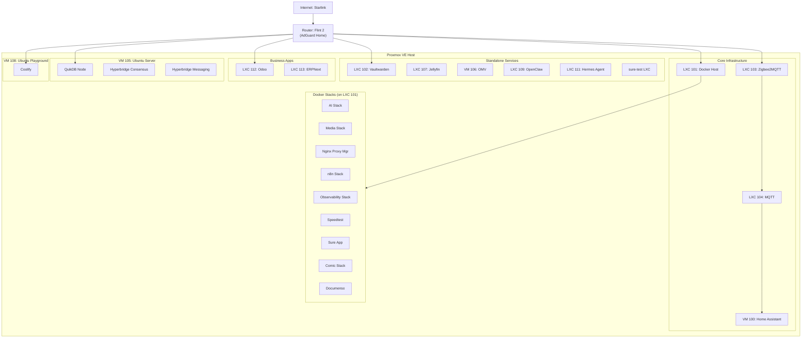

# 🏡 Dan-EL's Homelab


## 📋 Summary

Welcome to the documentation for my personal homelab. This repository serves as a configuration backup and an architectural reference.

The core infrastructure is built on [**Proxmox VE**](https://www.proxmox.com/en/products/proxmox-virtual-environment/overview). To maintain a clean and reproducible setup, I utilize **LXC containers** for most services to keep overhead low.

**Core Architecture:**

1.  **Hypervisor:** Proxmox VE.
2.  **Provisioning:** LXCs are created using the [Proxmox VE Helper-Scripts](https://community-scripts.github.io/ProxmoxVE/).
3.  **Application Layer:** A specific "Docker Host" LXC runs [Portainer](https://github.com/portainer/portainer), which manages various application stacks.

---

## 🖥️ Hardware

| Device           | Model                                                                         | CPU                                              | RAM         | Storage                                                                                        | Kernel / OS                 |
| :--------------- | :---------------------------------------------------------------------------- | :----------------------------------------------- | :---------- | :--------------------------------------------------------------------------------------------- | :-------------------------- |
| **Proxmox Host** | [HP 290 G1 SFF](https://support.hp.com/us-en/document/ish_4947891-4947986-16) | Intel Core i3-8100 @ 3.60GHz (4 Cores)           | 32GB (DDR4) | 94GB (Boot/Root) + 4TB Samsung 990 PRO SSD + 5TB Seagate One Touch HDD + 12TB Seagate Exos HDD | Linux 6.14.8-2-pve          |
| **Router**       | [GL.iNet Flint 2 (GL-MT6000)](https://www.gl-inet.com/products/gl-mt6000/)    | MediaTek MT7986 (Filogic 830) Quad-core @ 2.0GHz | 1GB DDR4    | 8GB eMMC                                                                                       | OpenWrt 23.05 (Kernel 5.15) |

> **Note:** System currently running PVE Manager 9.2.6

---

## 🌐 Networking

- **Router:** Starlink ISP + GL-iNET Flint 2 router
- **DNS:** handled by AdGuard Home on router
- **Reverse Proxy:** Nginx Proxy Manager (local access) / Clouflare Tunnel (remote access)
- **VPN:** Surfshark / Tailscale (remote access too)

### Topology Diagram


```mermaid
graph TD
    Internet["Internet: Starlink"] --> Router["Router: Flint 2<br/>(AdGuard Home)"]

    subgraph Proxmox_Node ["Proxmox VE Host"]
        direction TB

        %% Core Infrastructure / IoT
        subgraph Core_Infra ["Core Infrastructure"]
            direction LR
            LXC_Docker["LXC 101: Docker Host"]
            VM_HA["VM 100: Home Assistant"]
            LXC_MQTT["LXC 104: MQTT"]
            LXC_Z2M["LXC 103: Zigbee2MQTT"]
        end

        %% Standalone Services
        subgraph Standalone ["Standalone Services"]
            LXC_Vault["LXC 102: Vaultwarden"]
            LXC_Jelly["LXC 107: Jellyfin"]
            VM_OMV["VM 106: OMV"]
            LXC_OpenClaw["LXC 109: OpenClaw"]
            LXC_Hermes["LXC 111: Hermes Agent"]
            LXC_SureTest["sure-test LXC"]
        end

        %% Business Apps
        subgraph Business_Apps ["Business Apps"]
            LXC_Odoo["LXC 112: Odoo"]
            LXC_ERPNext["LXC 113: ERPNext"]
        end

        %% Secondary Docker Host (Ubuntu VM)
        subgraph VM_Ubuntu ["VM 105: Ubuntu Server"]
            Container_QuikDB["QuikDB Node"]
            Container_Consensus["Hyperbridge Consensus"]
            Container_Messaging["Hyperbridge Messaging"]
        end

        %% Ubuntu Playground
        subgraph VM_Coolify ["VM 108: Ubuntu Playground"]
             App_Coolify["Coolify"]
        end

        %% Main Docker Stacks
        subgraph Docker_Stacks ["Docker Stacks (on LXC 101)"]
            Stack_AI["AI Stack"]
            Stack_Media["Media Stack"]
            Stack_NPM["Nginx Proxy Mgr"]
            Stack_n8n["n8n Stack"]
            Stack_Observability["Observability Stack"]
            Stack_Speed["Speedtest"]
            Stack_Sure["Sure App"]
            Stack_Comic["Comic Stack"]
            Stack_Documenso["Documenso"]
        end

        %% Connections inside Proxmox
        LXC_Docker --> Docker_Stacks
        LXC_Z2M --> LXC_MQTT
        LXC_MQTT --> VM_HA
    end

    %% Network flow from Router to VMs/LXCs
    Router --> LXC_Docker
    Router --> LXC_Z2M
    Router --> LXC_Vault
    Router --> LXC_Odoo
    Router --> Container_QuikDB
    Router --> App_Coolify
```

## 🛠️ Services & Inventory

### 1. Proxmox LXC/VM Inventory

Most LXCs below were provisioned using the [Proxmox VE Helper-Scripts](https://community-scripts.github.io/ProxmoxVE/).

| ID      | Name                                                                 | Type | Helper Script Used                                                                                               | Notes                                                                                                                                                             |
| :------ | :------------------------------------------------------------------- | :--- | :--------------------------------------------------------------------------------------------------------------- | :---------------------------------------------------------------------------------------------------------------------------------------------------------------- |
| **100** | [`homeassistant`](https://github.com/home-assistant)                 | VM   | [Home Assistant OS](https://raw.githubusercontent.com/community-scripts/ProxmoxVE/main/vm/haos-vm.sh)            | Open source home automation that puts local control and privacy first. Currently running HAOS 16.2.                                                               |
| **101** | [`docker`](https://github.com/docker)                                | LXC  | [Docker](https://raw.githubusercontent.com/community-scripts/ProxmoxVE/main/vm/haos-vm.sh)                       | Docker is a containerization platform that provides easy way to containerize your applications.                                                                   |
| **102** | [`vaultwarden`](https://github.com/dani-garcia/vaultwarden)          | LXC  | [Vaultwarden](https://raw.githubusercontent.com/community-scripts/ProxmoxVE/main/install/vaultwarden-install.sh) | Vaultwarden is a powerful and flexible alternative password manager to Bitwarden that is particularly suitable for users who want to manage their data themselves |
| **103** | [`zigbee2mqtt`](https://github.com/Koenkk/zigbee2mqtt)               | LXC  | [Zigbee2MQTT](https://raw.githubusercontent.com/community-scripts/ProxmoxVE/main/install/zigbee2mqtt-install.sh) | Zigbee2MQTT bridges events and allows you to control your Zigbee devices via MQTT.                                                                                |
| **104** | [`mqtt`](https://github.com/mqtt)                                    | LXC  | [MQTT](https://raw.githubusercontent.com/community-scripts/ProxmoxVE/main/install/mqtt-install.sh)               | MQTT is an OASIS standard messaging protocol for the Internet of Things (IoT)Protocol                                                                             |
| **105** | [`ubuntu server`](https://github.com/ubuntu)                         | VM   | [Ubuntu Server OS ISO](https://ubuntu.com/download/server)                                                       | Host for Hyperbridge Relayers & QuickDB.                                                                                                                          |
| **106** | [`openmediavault`](https://github.com/openmediavault/openmediavault) | VM   | [openmediavault ISO](https://www.openmediavault.org/download.html)                                               | openmediavault is the next generation network attached storage (NAS) solution based on Debian Linux.                                                              |
| **107** | [`jellyfin`](https://github.com/jellyfin/jellyfin)                   | LXC  | [Jellyfin](https://raw.githubusercontent.com/community-scripts/ProxmoxVE/main/install/jellyfin-install.sh`)      | Jellyfin is a Free Software Media System that puts you in control of managing and streaming your media.                                                           |
| **108** | [`ubuntu playground`](https://github.com/ubuntu)                     | VM   | [Ubuntu Server OS ISO](https://ubuntu.com/download/server)                                                       | Host for [Coolify](https://github.com/coollabsio/coolify) and testing things.                                                                                     |                                                               |
| **109** | [`hermesagent`](https://github.com/hermes-agent)                     | LXC  | [Hermes Agent](https://raw.githubusercontent.com/community-scripts/ProxmoxVE/main/install/hermesagent-install.sh) | Hermes Agent service.                                                                                                                                             |
| **111** | [`sure test`]()                               | LXC  | [Sure](https://raw.githubusercontent.com/community-scripts/ProxmoxVE/main/install/odoo-install.sh)               | Sure is personal finance app for everyone (by everyone).                                      |
| **113** | [`erpnext`](https://github.com/frappe/erpnext)                       | LXC  | [ERPNext](https://raw.githubusercontent.com/community-scripts/ProxmoxVE/main/install/erpnext-install.sh)         | ERPNext is a full-featured open source ERP system built on the Frappe Framework.                                                                                  |

### 2. Docker Stacks

These services run inside the **Docker Host (LXC 101)**. Configurations for these can be found in the `/docker` directory of this repo.

| Stack Name              | Services Included                                                                                                                                                                                                                                                                                                                                                                                                                                                                                                                                                                                                                                                                                                                                         | Config Location                                               |
| :---------------------- | :-------------------------------------------------------------------------------------------------------------------------------------------------------------------------------------------------------------------------------------------------------------------------------------------------------------------------------------------------------------------------------------------------------------------------------------------------------------------------------------------------------------------------------------------------------------------------------------------------------------------------------------------------------------------------------------------------------------------------------------------------------- | :------------------------------------------------------------ |
| **AI**                  | [LiteLLM](https://github.com/BerriAI/litellm), [Ollama](https://github.com/ollama/ollama), [Qdrant](https://github.com/qdrant/qdrant)                                                                                                                                                                                                                                                                                                                                                                                                                                                                                                                                                                                                                     | [`/docker/ai-stack`](./docker/ai-stack)                       |
| **Media**               | [Audiobookshelf](https://github.com/advplyr/audiobookshelf), [Bazarr](https://github.com/morpheus65535/bazarr), [Bookshelf](https://github.com/pennydreadful/bookshelf), [Dispatcharr](https://github.com/Dispatcharr/Dispatcharr), [Flaresolverr](https://github.com/FlareSolverr/FlareSolverr), [Gluetun](https://github.com/qdm12/gluetun), [JDownloader 2](https://github.com/jlesage/docker-jdownloader-2), [Seerr](https://github.com/seerr-team/seerr), [Lidarr](https://github.com/Lidarr/Lidarr),[Plex](https://www.plex.tv/media-server-downloads/), [Prowlarr](https://github.com/Prowlarr/Prowlarr), [Radarr](https://github.com/Radarr/Radarr), [Sonarr](https://github.com/Sonarr/Sonarr), [Qbittorrent](https://github.com/qbittorrent/qBittorrent) | [`/docker/media-stack`](./docker/media-stack)                 |
| **n8n**                 | [Cloudflared](https://github.com/cloudflare/cloudflared), [Gotenberg](https://github.com/gotenberg/gotenberg), [n8n](https://github.com/n8n-io/n8n), [Postgres](https://github.com/postgres/postgres), [Redis](https://github.com/redis/redis)                                                                                                                                                                                                                                                                                                                                                                                                                                                                                                                | [`/docker/n8n-stack`](./docker/n8n-stack)                     |
| **Nginx Proxy Manager** | [Maria DB](https://github.com/jc21/docker-mariadb-aria) , [Nginx](https://github.com/nginx/nginx)                                                                                                                                                                                                                                                                                                                                                                                                                                                                                                                                                                                                                                                         | [`/docker/nginx-proxy-manager`](./docker/nginx-proxy-manager) |
| **Observability**       | [Alloy](https://github.com/grafana/alloy), [Grafana](https://github.com/grafana/grafana), [Kuma](https://github.com/louislam/uptime-kuma), [Loki](https://github.com/grafana/loki), [Prometheus](https://github.com/prometheus/prometheus/)                                                                                                                                                                                                                                                                                                                                                                                                                                                                                                               | [`/docker/observability-stack`](./docker/observability-stack) |
| **Speedtest Tracker**   | [Speedtest Tracker ](https://github.com/alexjustesen/speedtest-tracker)                                                                                                                                                                                                                                                                                                                                                                                                                                                                                                                                                                                                                                                                                   | [`/docker/speedtest`](./docker/speedtest)                     |
| **Sure App**            | [Sure app](https://github.com/we-promise/sure), [Redis](https://github.com/redis/redis), [Postgres](https://github.com/postgres/postgres), [Postgres local backup ](https://github.com/prodrigestivill/docker-postgres-backup-local)                                                                                                                                                                                                                                                                                                                                                                                                                                                                                                                      | [`/docker/sure-app`](./docker/sure-app)                       |
| **Comic**               | [Kavita](https://github.com/Kareadita/Kavita), [Komga](https://github.com/gotson/komga)                                                                                                                                                                                                                                                                                                                                                                                                                                                                                                                                                                                                                                                                   | [`/docker/comic-stack`](./docker/comic-stack)                 |
| **Documenso**           | [Documenso](https://github.com/documenso/documenso), [Postgres](https://github.com/postgres/postgres)                                                                                                                                                                                                                                                                                                                                                                                                                                                                                                                                                                                                                                                     | [`/docker/documenso`](./docker/documenso)                     |

> The **Sure App** test environment ([`/docker/sure-test-lxc`](./docker/sure-test-lxc)) runs on a dedicated `sure-test` LXC (`192.168.8.31`), separate from the Docker Host. It mirrors the Sure App stack (web, worker, Postgres 16, Redis) for testing branches/PRs — see its [guide.md](./docker/sure-test-lxc/guide.md).

---

### 3. Blockchain Services (on VM 105)

These services run manually on the Ubuntu Server.

| Service                                                                                                | Image                                     | Config Location                                                         |
| :----------------------------------------------------------------------------------------------------- | :---------------------------------------- | :---------------------------------------------------------------------- |
| [**Messaging Relayer**](https://docs.hyperbridge.network/developers/network/relayer/messaging/relayer) | `polytopelabs/tesseract:latest`           | [`/proxmox/ubuntu-vm-105`](./proxmox/ubuntu-vm-105)                     |
| [**Consensus Relayer**](https://docs.hyperbridge.network/developers/network/relayer/consensus/relayer) | `polytopelabs/tesseract-consensus:latest` | [`/proxmox/ubuntu-vm-105`](./proxmox/ubuntu-vm-105)                     |
| [**QuikDB Node** ](https://nodes.quikdb.com/)                                                          | `bash script`                             | [`documentation`](https://docs.quikdb.com/getting-started/quick-deploy) |

## 📂 Repository Structure

```text

├── docker/                    # Docker Compose files (LXC 101 Stacks)
│   ├── ai-stack/           # ollama, LiteLLM, Qdrant
│   │   └── docker-compose.yaml
│   ├── comic-stack/           # Kavita, Komga
│   │   └── docker-compose.yaml
│   ├── documenso/             # Documenso, Postgres
│   │   └── docker-compose.yaml
|   ├── media-stack/           # Arrs, Jellyseerr, Qbittorrent, Gluetun
│   │   └── docker-compose.yaml
│   ├── nginx-proxy-manager/   # NPM and MariaDB
│   │   └── docker-compose.yaml
│   ├── n8n-stack/             # Cloudflared, n8n
│   │   └── docker-compose.yaml
│   ├── observability-stack/  # Alloy, Grafana, Kuma, Loki, Prometheus
│   │   └── docker-compose.yaml
│   ├── speedtest/             # Speedtest Tracker
│   │   └── docker-compose.yaml
│   ├── sure-app/              # Sure App, Redis, Postgres
│   │   └── docker-compose.yaml
│   └── sure-test-lxc/         # Sure App test env (dedicated LXC)
│       ├── docker-compose.yaml
│       └── guide.md           # Branch/PR testing workflow
├── proxmox/                   # Host & Non-Docker Configs
│   ├── home-assistant/        # HA configurations (YAMLs, backups)
│   │   ├── automations.yaml
│   │   ├── configuration.yaml
│   │   ├── dashboards.yaml
│   │   ├── modbus.yaml
│   │   ├── sensors.yaml
│   │   └── template.yaml
│   └── ubuntu-vm-105/
│       └── hyperbridge-relayer/
│           ├── consensus-config.toml  # Config for Consensus Relayer
│           └── messaging-config.toml  # Config for Messaging Relayer
└── scripts/
    ├── backup-all.sh   # Encrypt and backup docker stacks with data to Cloudflare R2
    ├── proxmox-backup.ps1  # Move backups on Proxmox host HDD to work laptop
    ├── update-lxcs.sh     # Update the LXC containers using the helper scripts
    └── update-proxmox.sh  # Update Proxmox host
```

## ⚙️ Misc & Maintenance

### Backups

- **LXC/VM (System):** Backed up **Weekly** to two HDDs attached to the home server.
  - A replication copy is sent to a work laptop's SSD to ensure redundancy.
- **Docker (Data):** Backed up **Daily** to Cloudflare R2 using a custom backup script that encrypts data before upload.

### Updates

- **Proxmox Host:** Custom script runs monthly updates.
- **LXC Containers:** Custom script runs monthly updates.
- **Docker Containers:** Managed via Portainer.

## 📜 License

This repository is for documentation purposes.
